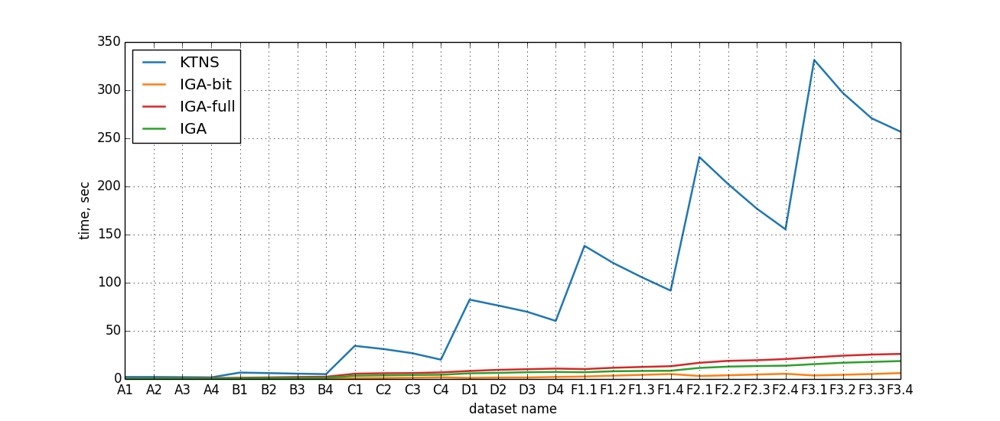

[](https://pubsonline.informs.org/journal/ijoc)

# A Computational Study of the Tool Replacement Problem

This archive is distributed in association with the [INFORMS Journal on
Computing](https://pubsonline.informs.org/journal/ijoc) under the [MIT License](LICENSE).

The software and data in this repository are a snapshot of the software and data
that were used in the research reported on in the paper 
[A Computational Study of the Tool Replacement Problem](https://doi.org/10.1287/ijoc.2023.0474) by Yuzhuo Qiu, Mikhail Cherniavskii, Boris Goldengorin, Panos M. Pardalos.  

## Cite

To cite the contents of this repository, please cite both the paper and this repo, using their respective DOIs.

https://doi.org/10.1287/ijoc.2023.0474

https://doi.org/10.1287/ijoc.2023.0474.cd

Below is the BibTex for citing this snapshot of the repository.

```
@misc{ToolReplacementProblem,
  author =        {Yuzhuo Qiu, Mikhail Cherniavskii, Boris Goldengorin, Panos M. Pardalos},
  publisher =     {INFORMS Journal on Computing},
  title =         {A Computational Study of the Tool Replacement Problem},
  year =          {2023},
  doi =           {https://doi.org/10.1287/ijoc.2023.0474.cd},
  note =          {Available for download at https://github.com/INFORMSJoC/2023.0474},
} 
```

## Description

This software aims to compare IGA and KTNS algorithms for the Tool Replacement Problem.
The experiments were conducted on a server running a 64-bit Windows 10 operating system, equipped with Intel(R) Core i5 CPU 2.6 GHz and 4 GB of RAM.
To compare KTNS and IGA algorithms for each of the 10 problem instances of data sets
from [Catanzaro et al.](https://doi.org/10.1016/j.ejor.2015.02.018) we generate 10<sup>5</sup> job sequences. Additionally, for each of the 5
problem instances of data sets from [Mecler et al.](https://doi.org/10.1016/j.cor.2020.105153) we generate 2·10<sup>5</sup> job sequences.

* src/main.cpp contains the algorithms and experiments implemented in C++.
* scripts/tests.py еxecutes src/main.cpp and plots a graph to present the performance or outcome of the experiments.

## Results

Figure 8 in the paper shows the results of the Comparison of KTNS and IGA algorithms for [Catanzaro et al.](https://doi.org/10.1016/j.ejor.2015.02.018) and [Mecler et al.](https://doi.org/10.1016/j.cor.2020.105153) datasets.



## Replicating

In Linux, to replicate the results do

```
make all
```
